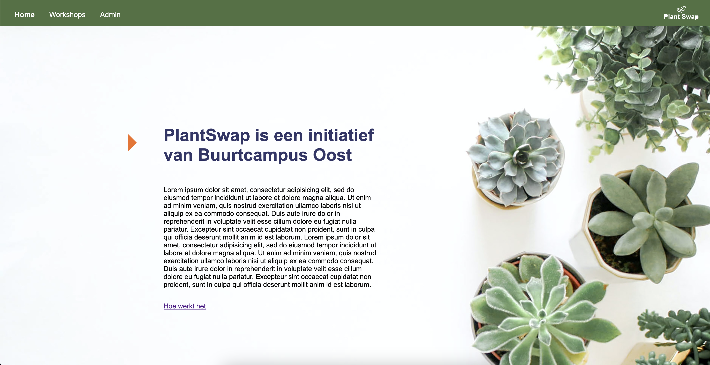
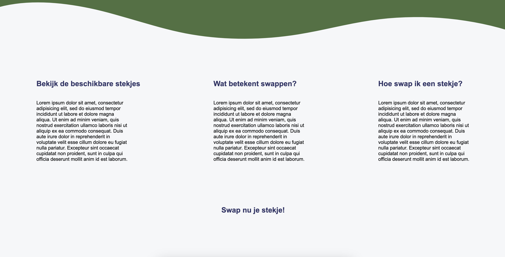
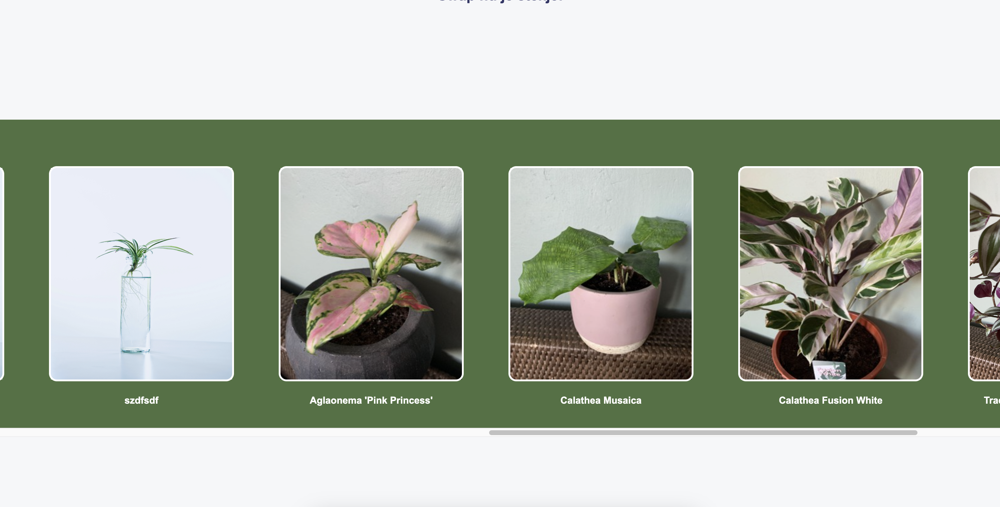

> _Fork_ deze leertaak en ga aan de slag. Onderstaande outline ga je gedurende deze taak in jouw eigen GitHub omgeving uitwerken. De instructie vind je in: [docs/INSTRUCTIONS.md](docs/INSTRUCTIONS.md)

# PlantSwap

<!-- Geef je project een titel en schrijf in één zin wat het is -->

## Inhoudsopgave

* [Beschrijving](#beschrijving)
* [Kenmerken](#kenmerken)
* [Installatie](#installatie)
* [Gebruik](#gebruik)
* [Bronnen](#bronnen)
* [Licentie](#licentie)

## Beschrijving

<!-- In de Beschrijving staat hoe je project er uit ziet, hoe het werkt en wat je er mee kan. -->
PlantSwap is een initiatief van Buurtcampus Oost. Bij de buurtcampus is er een stekjes kast ontwikkeld. Hierbij kunnen
belanghebbenden online een stekje reserveren en een ander stekje inruilen. Dit om verspilling tegen te gaan van planten
en buurtbewoners bij elkaar te brengen. De beschikbare stekjes die te zien zijn op de website komen uit een API. Er is een admin page ontwikkeld waarbij er nieuwe
stekjes geupload kunnen worden. 

<!-- Voeg een mooie poster visual toe 📸 -->

<!-- Voeg een link toe naar Github Pages 🌐-->
[Link naar mijn Github page ](https://github.com/joelle78/the-web-is-for-everyone-interactive-functionality)

## Kenmerken

<!-- Bij Kenmerken staat welke technieken zijn gebruikt en hoe. Wat is de HTML structuur? Wat zijn de belangrijkste dingen in CSS? Wat is er met Javascript gedaan en hoe? Misschien heb je een framwork of library gebruikt? -->
In deze leertaak hebben we weer gebruik gemaakt van een API. De API van Buurtcampus Oost
is: [Link naar API Buurtcampus Oost ](https://api.buurtcampus-oost.fdnd.nl/api/v1/stekjes). Hierbij hebben we weer
gebruik gemaakt van Node om server-side te kunnen programmeren. Met de templating taal EJS kan je de HTML-opmaak
genereren met JavaScript. Dit zorgt er ook voor dat je in je partials maar een keer code hoeft te schrijven maar zich
kan herhalen op je gehele website. Ook heb ik weer gebruik gemaakt van JSON. Daarnaast heb ik er voor gekozen om de
mappen structuren zelf te installeren in plaats van mij oude project te kopiëren. Dit heb ik gedaan met Express en de $
npm init command.

Om gebruikers van de website data te kunnen toevoegen aan de website is er gebruikt gemaakt van de methode progressive
enhancement. Met progressive enhancement bouw je je website in 3 lagen:

1. Eerst bouw je de core functionality van je website in HTML en met behulp van formulieren en NodeJS, voor het
   server-side afhandelen van het posten van data. (Content layer)
2. Daarna voeg je CSS toe voor feedback voor de gebruiker en om de huisstijl toe te passen. (Presentation layer)
3. Tot slot voeg je JavaScript (en CSS) toe om de User Experience te verbeteren. (Client-side scripting)

Met progressive enhancement wordt er eerst gebouwd aan de basisfuncties, en vervolgens worden er stapsgewijs extra
functies toegevoegd voor gebruikers met meer geavanceerde apparaten of browsers, terwijl de website nog steeds
toegankelijk blijft voor alle gebruikers.

## Installatie

Om mijn website te publiceren heb ik gebruik gemaakt van cyclic.sh als hostingpartij.

## Gebruik

## Bronnen

https://www.cyclic.sh/
https://nodejs.org/en/
https://api.buurtcampus-oost.fdnd.nl/api/v1/stekjes
https://ejs.co/
https://expressjs.com/
https://www.json.org/json-en.html
https://statics.teams.cdn.office.net/evergreen-assets/safelinks/1/atp-safelinks.html

## Licentie

This project is licensed under the terms of the [MIT license](./LICENSE).
