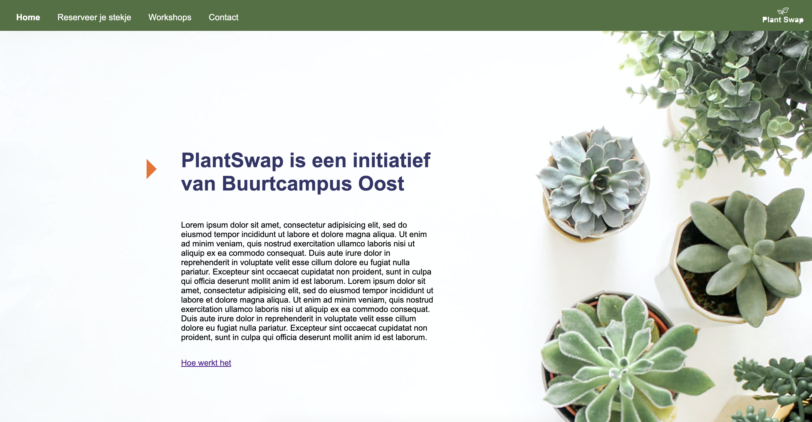
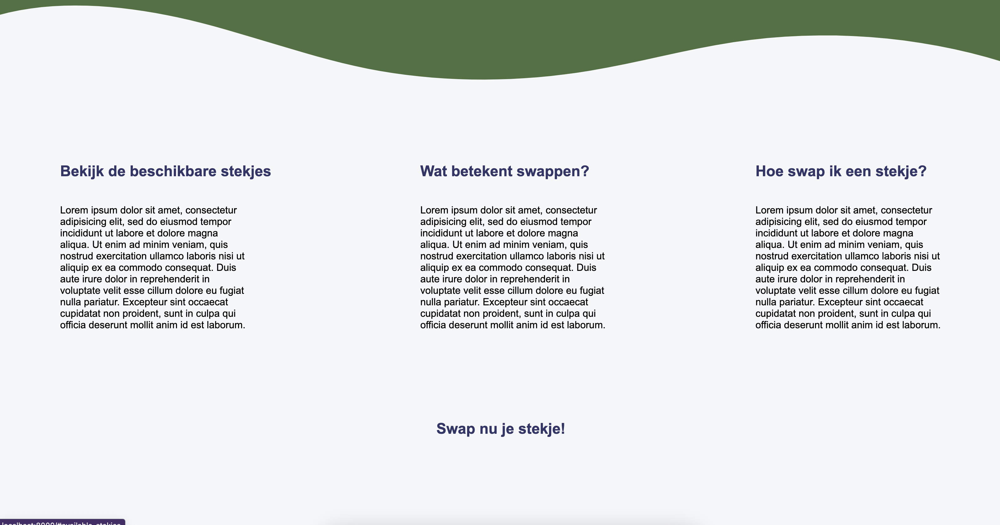

> _Fork_ deze leertaak en ga aan de slag. Onderstaande outline ga je gedurende deze taak in jouw eigen GitHub omgeving uitwerken. De instructie vind je in: [docs/INSTRUCTIONS.md](docs/INSTRUCTIONS.md)

# PlantSwap

<!-- Geef je project een titel en schrijf in één zin wat het is -->

## Inhoudsopgave

* [Beschrijving](#beschrijving)
* [Kenmerken](#kenmerken)
* [Installatie](#installatie)
* [Gebruik](#gebruik)
* [Bronnen](#bronnen)
* [Licentie](#licentie)

## Beschrijving

<!-- In de Beschrijving staat hoe je project er uit ziet, hoe het werkt en wat je er mee kan. -->
De sprint staat in thema van server side rendering. Hierin leren we hoe je op de server webpagina's kunt maken met
content uit een database. De opdracht die we maken is weer voor een opdrachtgever. Ik heb gekozen om bij mij oude
opdrachtgever te blijven: Buurtcampus Oost.

<!-- Voeg een mooie poster visual toe 📸 -->

<!-- Voeg een link toe naar Github Pages 🌐-->
[Link naar mijn Github page ](https://github.com/joelle78/server-side-rendering)

## Kenmerken

<!-- Bij Kenmerken staat welke technieken zijn gebruikt en hoe. Wat is de HTML structuur? Wat zijn de belangrijkste dingen in CSS? Wat is er met Javascript gedaan en hoe? Misschien heb je een framwork of library gebruikt? -->
In deze leertaak hebben we weer gebruik gemaakt van een API. De API van Buurtcampus Oost
is: [Link naar API Buurtcampus Oost ](https://api.buurtcampus-oost.fdnd.nl/api/v1/stekjes). Hierbij hebben we weer gebruik
gemaakt van Node om server-side te kunnen programmeren. Met de templating taal EJS kan je de HTML-opmaak genereren met
JavaScript. Dit zorgt er ook voor dat je in je partials maar een keer code hoeft te schrijven maar zich kan herhalen op
je gehele website. Ook heb ik weer gebruik gemaakt van JSON. Daarnaast heb ik er voor gekozen om de mappen structuren
zelf te installeren in plaats van mij oude project te kopiëren. Dit heb ik gedaan met Express en de $ npm init command.

## Installatie
Om mijn website te publiceren heb ik gebruik gemaakt van cyclic.sh als hostingpartij.

## Gebruik

## Bronnen
https://www.cyclic.sh/
https://nodejs.org/en/
https://api.buurtcampus-oost.fdnd.nl/api/v1/stekjes
https://ejs.co/
https://expressjs.com/
https://www.json.org/json-en.html
https://statics.teams.cdn.office.net/evergreen-assets/safelinks/1/atp-safelinks.html

## Licentie
This project is licensed under the terms of the [MIT license](./LICENSE).
